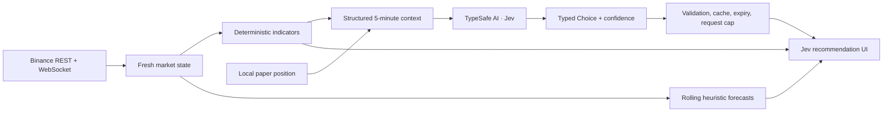

# Jev Trade

[](https://github.com/adebmbng/jev-trade-prediction/actions/workflows/ci.yml)
[](https://www.typescriptlang.org/)
[](https://docs.docker.com/compose/)
[](https://typesafe.ai/)

**A live, mobile-first crypto decision dashboard for traders who think in seconds, not hours.**

Jev Trade turns fast BTCUSDT and ETHUSDT market movement into one focused view: live candles, technical context, rolling forecasts, a TypeSafe AI-powered Jev recommendation, and paper-position guidance with just enough sarcasm to keep overconfidence uncomfortable.

The product is built around a simple question:

> Given what the market has done over the last five minutes, what is the most defensible action for the next one or two minutes?

It is deliberately opinionated, transparent, and experimental. The app shows its inputs, keeps stale recommendations visibly marked, never invents prices when feeds fail, and never places an order for you.

## Why Jev Trade?

Short-horizon trading is noisy. A chart can show ten indicators and still leave the trader asking, “So… long, short, exit, or wait?” Jev Trade keeps the measurements deterministic and asks AI for one bounded judgment—not an essay, a personality-driven chatbot, or a promise of profit.

| What you get             | Why it matters                                                                                                   |
| ------------------------ | ---------------------------------------------------------------------------------------------------------------- |
| Live Binance candles     | Watch 5s, 30s, 1m, and native 5m context without fabricated fallback data.                                       |
| Technical analysis       | EMA 9/21/50, SMA 200, RSI, MACD, ATR, ADX/DI, Bollinger bands, relative volume, OBV, support, and resistance.    |
| Rolling forecasts        | Compare +5s, +30s, +1m, +2m, and +5m heuristic direction from a fresh reference price.                           |
| Jev recommendation       | Get a typed `long`, `short`, or `wait` entry judgment for a 60–120 second objective.                             |
| Position-aware follow-up | After entry, Jev changes the question to `exit` or `wait` using side, age, return, giveback, and market context. |
| 100× leverage awareness  | Raw price changes are translated into approximate leveraged gross impact so tiny moves are treated as material.  |
| Honest refresh behavior  | The previous recommendation stays readable while a spinner marks the next Jev call as in flight.                 |
| Paper positions          | Experiment locally in the browser without exchange keys, accounts, or automatic execution.                       |
| A little attitude        | Go short after Jev says long and the position card will notice. Politely? Absolutely not.                        |

## TypeSafe AI: judgment as a programming primitive

Jev Trade uses [TypeSafe AI](https://typesafe.ai/) and its Jev System One model for a narrow, typed decision inside an otherwise deterministic application.

The server sends structured state plus one TypeSafe Choice question. Jev returns a selected option, a probability distribution, and confidence. Application code validates that response, owns freshness and risk rules, and decides what appears in the interface. Jev does not generate the dashboard, execute trades, or return free-form trading stories.

Before entry, the available choices are:

```text
long | short | wait
```

After entry, they become:

```text
exit | wait
```

The state sent to Jev includes:

- the previous five minutes of continuous market data, compressed into 5s OHLCV bars;
- exact 5s, 30s, 60s, 120s, and 300s price changes;
- technical indicators calculated from closed 5m candles;
- the configured leverage and approximate leveraged move impact;
- position side, entry price, age, raw return, observed best price, and giveback after entry;
- explicit limitations around fees, funding, slippage, maintenance margin, liquidation, and unavailable order-book data.

The sarcastic copy is assembled locally from the typed decision and measured facts. There is no second text-generation model quietly spending tokens to tell you that your losing trade is “an exciting learning opportunity.”

Learn more in the [TypeSafe API documentation](https://docs.typesafe.ai/api.md) and [System One guide](https://docs.typesafe.ai/concepts/system-one.md).

## How it works



The browser receives public market data directly from Binance. The Fastify backend maintains its own market state for forecasts and Jev requests, keeps `TYPESAFE_API_KEY` server-side, validates every typed answer, coalesces identical requests, and limits model traffic.

## Product behavior worth knowing

- Jev is called immediately when fresh data becomes available, when the symbol changes, and when a position is opened. It refreshes every 15 seconds after the previous call completes.
- A successful recommendation is valid for 15 seconds. The last successful result remains visible as **Previous** while its replacement loads.
- The server allows at most 12 Jev calls per minute per process and applies a 30-second cooldown after provider failures.
- The Jev request times out after 6 seconds. The browser stops waiting after 6.5 seconds.
- Without `TYPESAFE_API_KEY`, the heuristic dashboard still works and the Jev panel explains that it is not configured.
- Jev confidence describes answer concentration. It is not a win probability or proof that a trade is safe.

## Quick start

Requirements: Node.js 22.12+ (Node 24 recommended) and pnpm 9+.

```sh
pnpm install
pnpm dev
```

Open [http://localhost:5173](http://localhost:5173). The API runs at `http://127.0.0.1:3001`.

To enable Jev locally, copy the example environment file and add your TypeSafe API key:

```sh
cp .env.example .env
```

```env
TYPESAFE_API_KEY=your_key_here
JEV_LEVERAGE=100
```

Start both processes with environment variables loaded:

```sh
node --env-file=.env --import tsx apps/api/src/index.ts
pnpm dev:web
```

## Docker Compose

Docker Compose is the simplest deployment path. Put `.env` beside `compose.yaml`, then run:

```sh
docker compose up -d --build
docker compose logs -f app
```

Open `http://SERVER_IP:8080` or `http://localhost:8080`.

Useful `.env` settings:

| Variable           | Default               | Purpose                                                                              |
| ------------------ | --------------------- | ------------------------------------------------------------------------------------ |
| `TYPESAFE_API_KEY` | empty                 | Enables server-side Jev recommendations.                                             |
| `JEV_LEVERAGE`     | `100`                 | Nominal leverage supplied to Jev and used for approximate gross impact.              |
| `APP_PORT`         | `8080`                | Host port exposed by Docker Compose.                                                 |
| `BIND_ADDRESS`     | `0.0.0.0`             | Host interface used by Docker Compose. Use `127.0.0.1` behind a local reverse proxy. |
| `TRUSTED_PROXIES`  | empty                 | Trusted proxy IP/CIDR list used for correct client rate limiting.                    |
| `BINANCE_REST`     | Binance public data   | Optional backend REST override.                                                      |
| `BINANCE_WS`       | Binance public stream | Optional backend WebSocket override.                                                 |

One container serves the built frontend, API, SSE forecast stream, and health endpoint. No database or persistent volume is required; paper positions stay in each browser's local storage.

For a public deployment, use HTTPS, disable reverse-proxy buffering for `/api/predictions/stream`, and only configure proxies you control in `TRUSTED_PROXIES`.

## Development and quality checks

```sh
pnpm typecheck
pnpm lint
pnpm test
pnpm build
pnpm exec playwright install chromium
pnpm test:ui
```

GitHub Actions runs the same typecheck, lint, unit tests, production build, and Playwright browser test on every pull request and push to `main`.

## Architecture

```text
apps/web                 React UI, direct Binance feed, charts, local positions
apps/api                 Fastify API, backend market feeds, SSE, Jev integration
packages/shared          Candles, indicators, forecasts, position math, replay
tests                    Deterministic unit tests and mocked browser behavior
.github/workflows        CI checks for every contribution
```

The frontend derives 5s and 30s candles from Binance 1s klines and uses native 1m/5m history. Gold horizontal segments mark each 5m opening; dotted vertical lines mark its boundaries. Chart controls do not change the 5m analysis timeframe.

The heuristic provider publishes rolling +5s/+30s/+1m/+2m/+5m estimates every five seconds. Each refresh receives a new reference price and target timestamp. These uncalibrated strength scores provide a deterministic baseline beside Jev's typed judgment.

## Contributing

**Jev Trade is looking for contributors.** If fast market interfaces, typed AI, trading research, frontend craft, testing, or gloriously dry error messages sound interesting, there is useful work waiting for you.

Good places to contribute:

- add more symbols or carefully designed exchange adapters;
- model fees, funding, maintenance margin, and liquidation more realistically;
- build reproducible historical datasets and benchmark Jev against deterministic baselines;
- improve accessibility, responsive layouts, chart interactions, and loading states;
- add evaluation fixtures for TypeSafe prompts and confidence thresholds;
- improve observability, distributed request limits, caching, and deployment guidance;
- expand replay reports, cost modeling, and outcome calibration;
- write docs, fix confusing copy, or contribute better sarcastic comments.

To contribute:

1. Fork the repository and create a focused branch.
2. Run `pnpm install` and reproduce the behavior you want to change.
3. Keep calculations and hard rules in code; use Jev only where a typed semantic judgment adds value.
4. Add meaningful tests for new behavior and run the full quality-check suite.
5. Open a pull request explaining the user problem, the resulting behavior, and any risk or cost tradeoffs. Screenshots are welcome for UI work.

Small fixes are welcome. Larger experiments are welcome. Thoughtful disagreement with the current design is especially welcome—bring evidence, a runnable idea, or a beautifully specific bug report.

## Roadmap ideas

- configurable watchlists and additional liquid markets;
- realistic leverage, fee, funding, and liquidation simulation;
- recorded sessions and shareable trade-review timelines;
- historical Jev evaluation and calibration dashboards;
- configurable sarcasm intensity, because apparently risk tolerance was not enough;
- authenticated multi-user deployments and distributed rate limiting;
- optional notifications without turning the app into an attention casino.

Have an idea that belongs here? [Open an issue](https://github.com/adebmbng/jev-trade-prediction/issues) or send a pull request.

## Important limitations

Jev Trade is an experimental paper-trading dashboard, not a broker, exchange, execution engine, or validated trading system.

- No orders are placed.
- Positions live only in browser local storage.
- Returns exclude fees, spread, slippage, funding, maintenance margin, and liquidation mechanics.
- The app does not receive order-book data.
- Observed favorable extremes can miss disconnected periods.
- A 100× leverage setting amplifies losses as aggressively as gains; approximately a 1% adverse raw move can consume initial margin before exchange-specific rules and costs.
- Typed output guarantees the response shape, not that the prediction is correct.
- Signals can be wrong at every horizon, especially over seconds.

Use the project to explore, test, measure, and contribute—not to outsource judgment.

## Data and libraries

- [Binance market-data-only endpoints](https://github.com/binance/binance-spot-api-docs/blob/master/faqs/market_data_only.md)
- [Binance WebSocket streams](https://developers.binance.com/docs/binance-spot-api-docs/web-socket-streams)
- [Binance REST market data](https://developers.binance.com/docs/binance-spot-api-docs/rest-api/market-data-endpoints)
- [TypeSafe AI documentation](https://docs.typesafe.ai/llms.txt)
- [TradingView Lightweight Charts](https://tradingview.github.io/lightweight-charts/docs)
